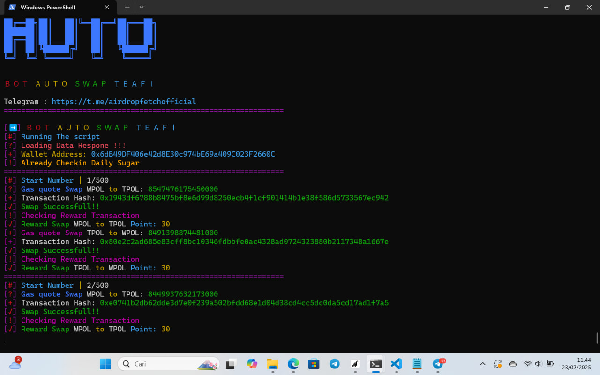

# teafi-auto-bot

## CHANNEL TELEGRAM JOIN HERE
[KLIK DISINI AIRDROP FETCH](https://t.me/airdropfetchofficial)

## Installation 
1. Clone the repository:
```bash
git clone https://github.com/bangzx/teafi-atuo-bot.git
```
2. Open File
```bash
cd teafi-auto-bot
```
3. Install Module
```bash
npm install
```
4. Change file **config.json** edit text number **"ITERATIONS": 500,** to confirm total swap
example:   **"ITERATIONS": 200,** so total swap 200x swapped

5. set your private key on file **.env**

6. Run the bot
```bash
node bot.js
```

